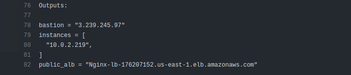
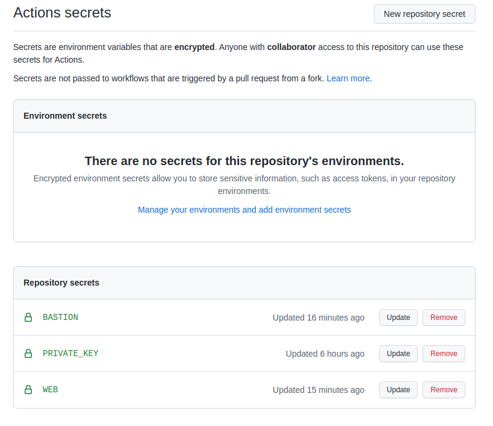

## Deploy Application to EC2 instances using GitHub Actions
### Steps:
- From the GitHub actions page for the infrastructure repo, expand the **Terraform Apply** step to get necessary outputs 
- Copy the bastion IP address and create a new GitHub secret on this repo with **BASTION** as name and the IP as the value
- Copy the instances ip into a **WEB** secret too, paste each IP on a new line
- Copy the contents of the private key file whose name you specified in the infrastructure variables
- Paste the contents as a **PRIVATE_KEY** secret. 
- Push this code for the deploy to start.