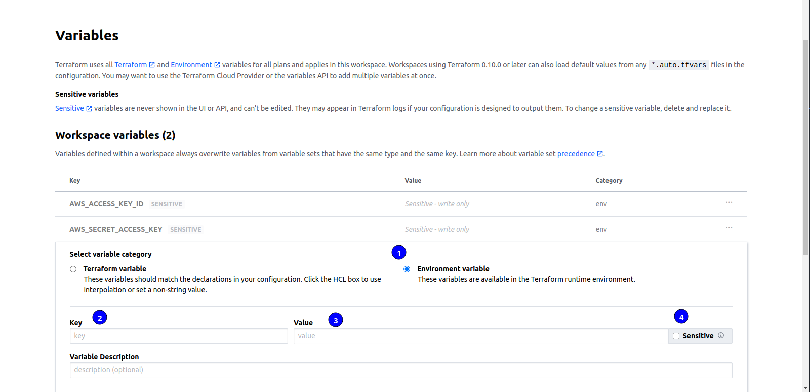

# Deploy Infrastructure in AWS Cloud
Deploys infrastructure to AWS Cloud using Terraform. Uses GitHub Actions Workflow for continuous integration.
## Resources
- One VPC
- Three public subnets in three AZs to host Application load balancer
- Three private subnets to host web servers
- Launch template for web servers
- Auto scaling group for web servers
- Security groups for web servers and ALB

## How to Use
- Replace the **keypair** variable in the environments/\<current-env\>/terraform.tfvars file with the name of an AWS keypair in the same region you want to deploy resources to
- Create a Terraform cloud account [here](https://app.terraform.io/)
- Create a new Workspace
- Select **API-driven workflow**
- Enter workspace name and description
- Click create
- In the **backend.tf** file, replace **organization** with your Terraform cloud organization name and **workspaces, name** with your workspace name
- On Terraform Cloud dashboard, click on the user profile icon on the top left.
- Click on **User settings**
- On the left pane, click Tokens
- Click **Create an API token**
- Enter a description and click **Create API Token** 
- Copy the generated token and head back to this repo on GitHub
- Click **Settings**, by the left, click **Secrets**
- Under Secrets, select Actions
- Click **New repository secret**
- For **Name**, enter **TERRAFORM_API_TOKEN**
- For **Value**, paste in the copied token from Terraform Cloud 
- On Terraform Cloud, click on Variables
- Under Workspace Variables, click **Add variable**
- Enter **AWS_ACCESS_KEY_ID** as key and your AWS access key id as value, check the sensitive box and also the **Environment Variable** radio button
- Repeat the same steps for your AWS secret access key as shown here 
- Push the code, and wait for deployment to complete